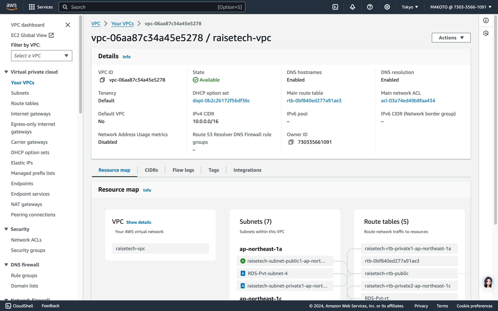
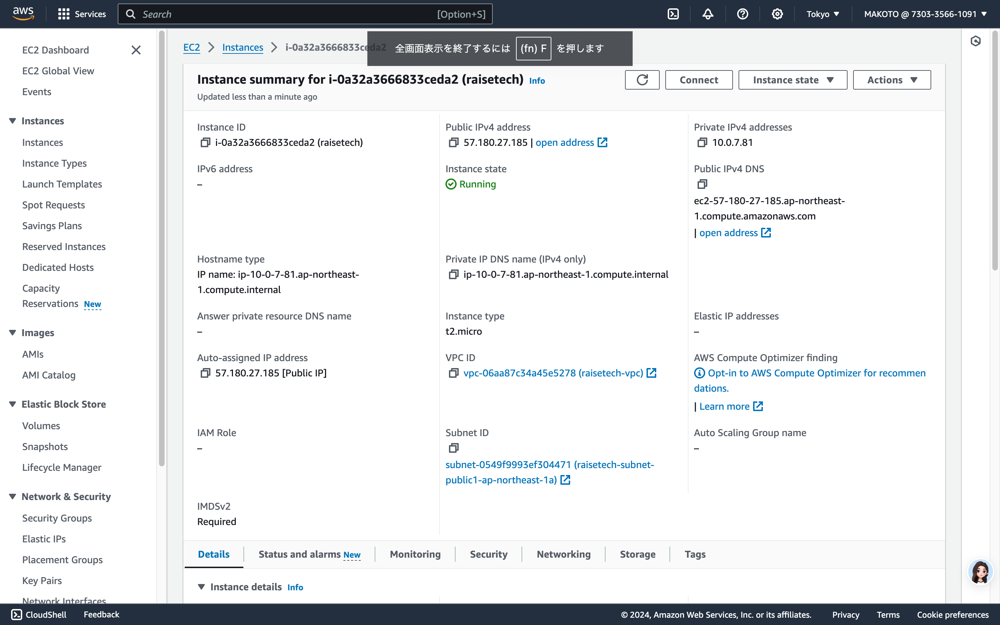
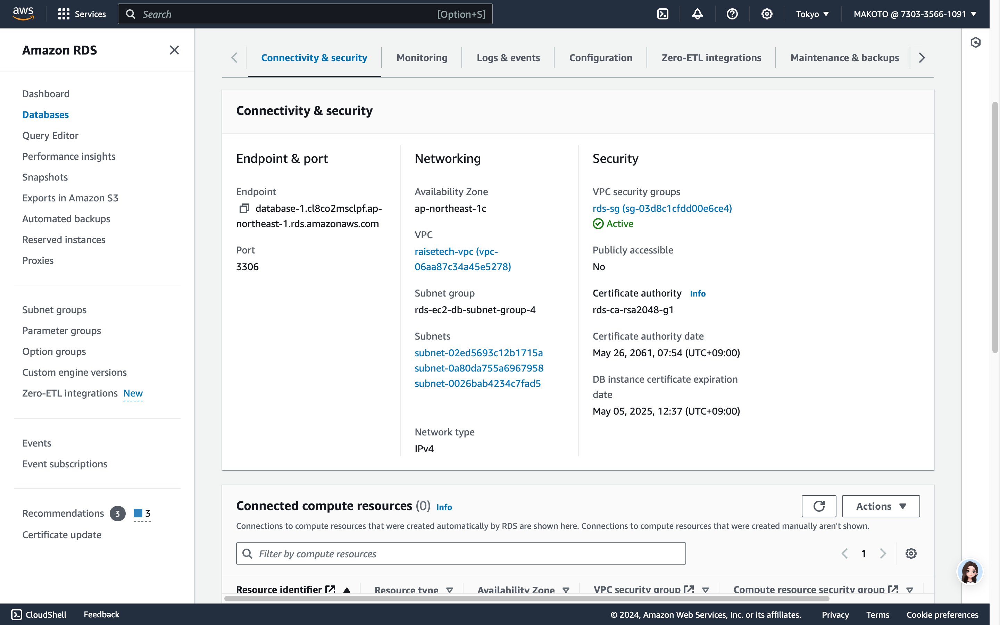
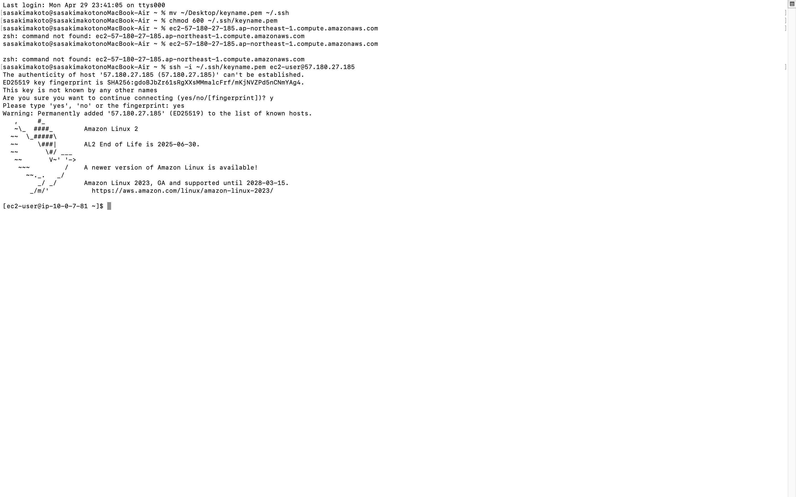
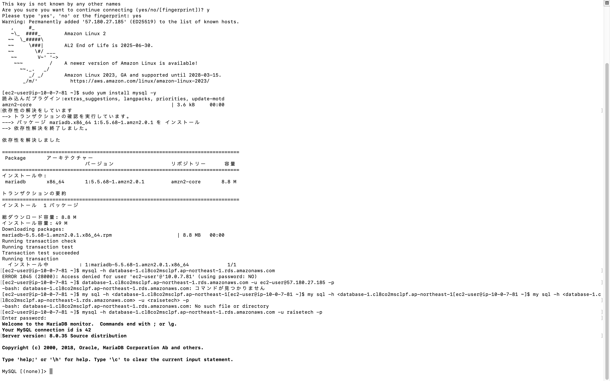

# AWSコース第3回講義の受講

## VPCの作成

## EC2の作成

## RDSの作成

## EC2インスタンスへのSSH接続

## EC2からRDS(Mysql)への接続

## 講義の感想
* VPC、EC2、RDS の作成においてそれぞれ関連性のあるものを作成するのに時間を費やしてしまった。
* 上記以外にもネットワーク関係の用語が多く出てきたため関連付けて把握する必要がある。
