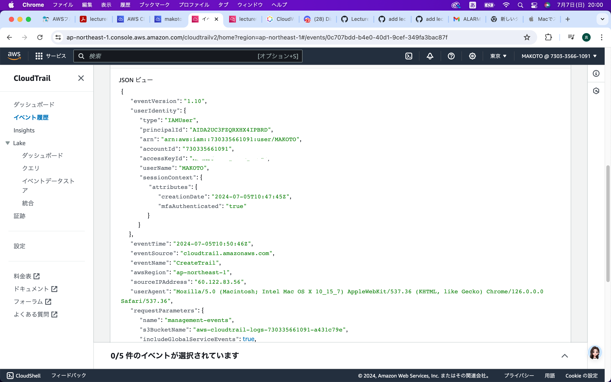
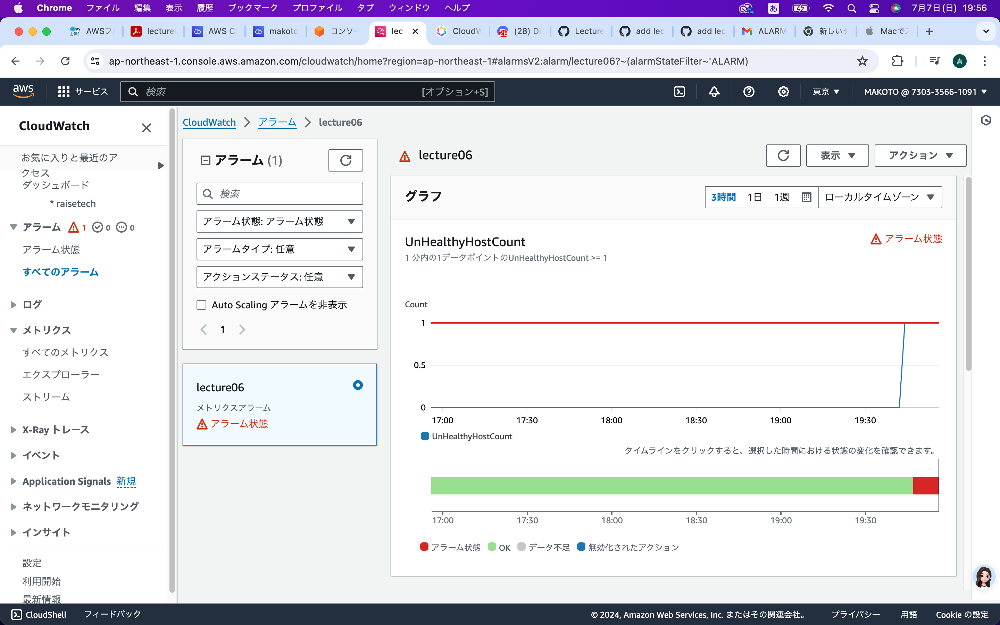
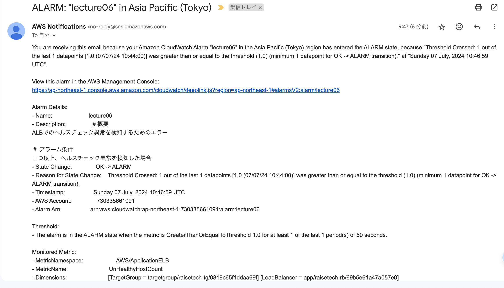
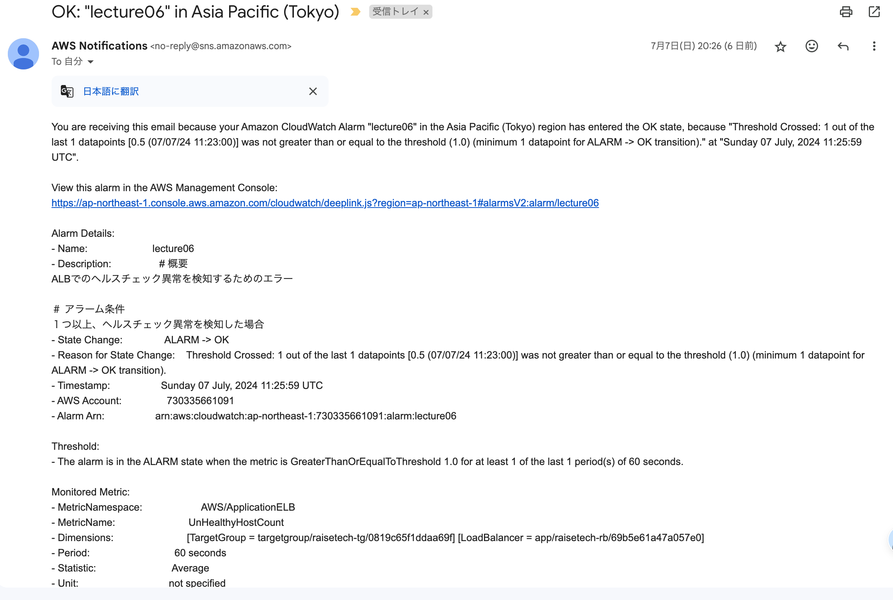
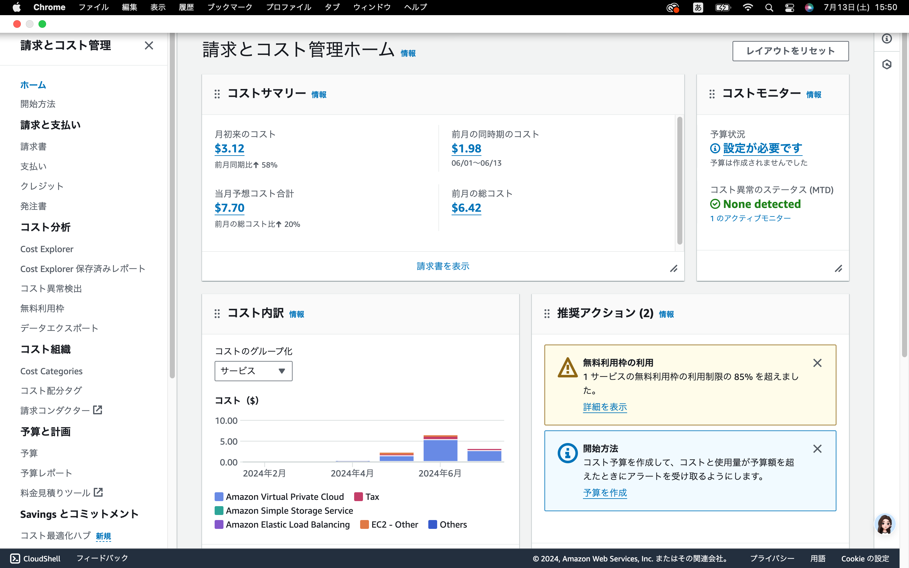
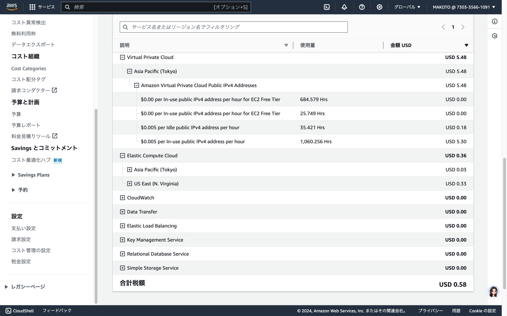

# AWSコース第6回講義の受講

## CloudTrailのイベント
* イベント名:CreateTrail
* 含まれている内容:"eventTime": "2024-07-05T10:48:38Z" 
                   "eventSource": "cloudtrail.amazonaws.com"
                   "awsRegion": "ap-northeast-1"

## CloudWatchアラームを使ってALBのアラーム設定
* 対象：ALB/UnhealtyHostCount
gity

## CloudWatchアラームメール通知
* OK→Alarmメールの受信
  Railsアプリケーションが使えない状態

* Alarm→OKメールの受信
　Railsアプリケーションが使える場合

## AWS利用料の見積もり
（https://calculator.aws/#/estimate?id=39298e88fa6867e7ee350c1bd094a24735dfb412）

## マネジメントコンソールから、現在の利用料を確認
* 2024年6月請求金額
パブリックIPアドレスの使用が無料枠を超えていたためVPCの料金が発生している。

