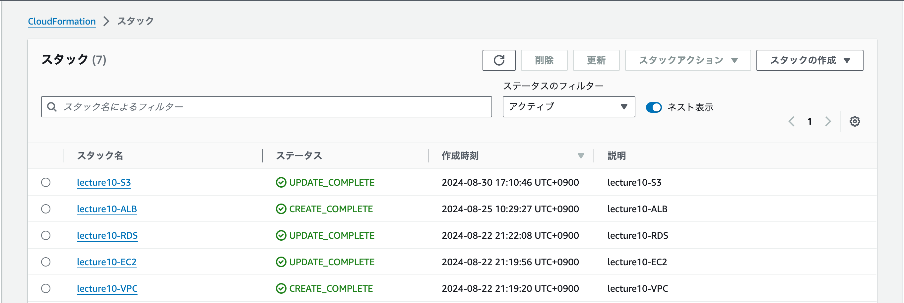
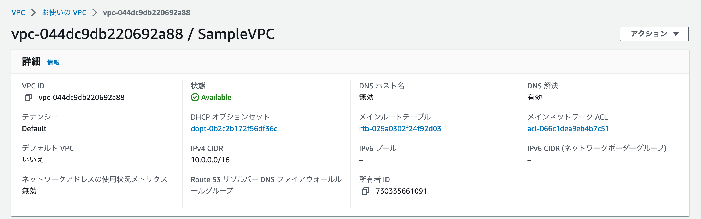
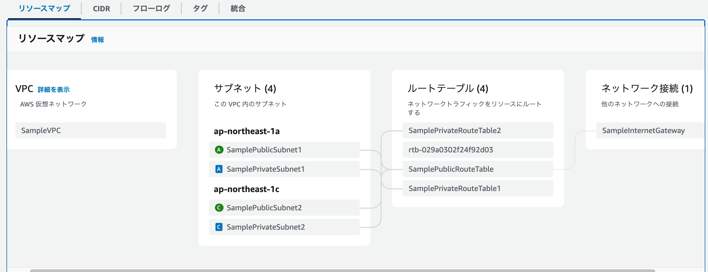
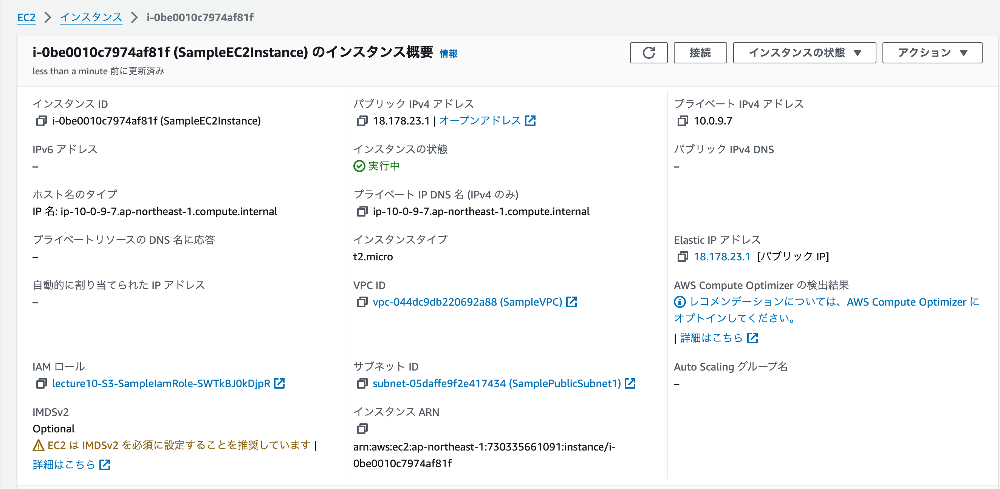
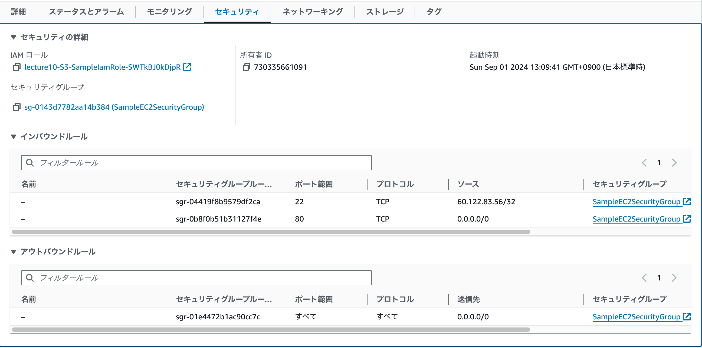
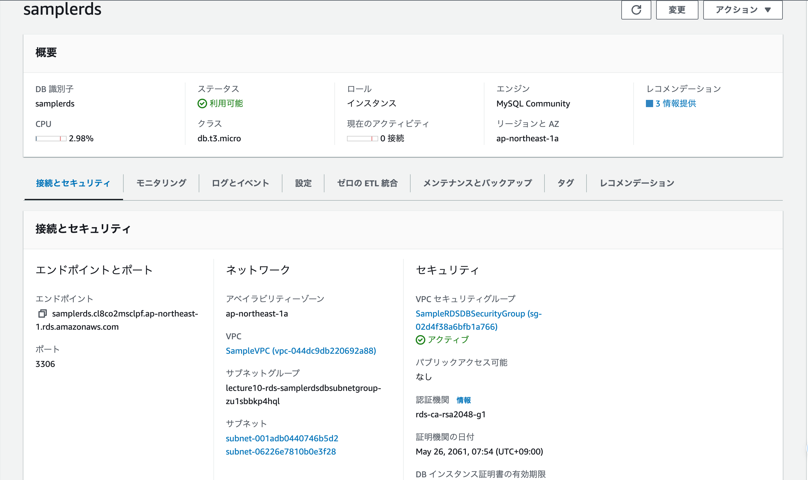
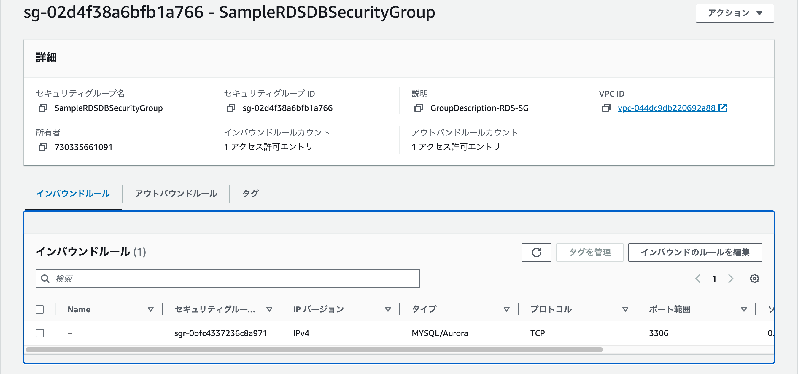
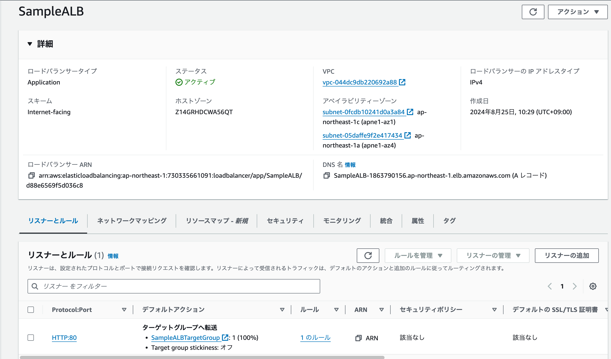
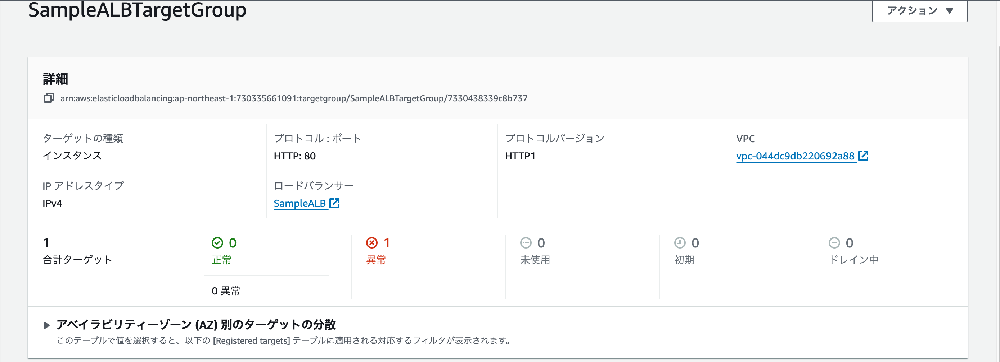
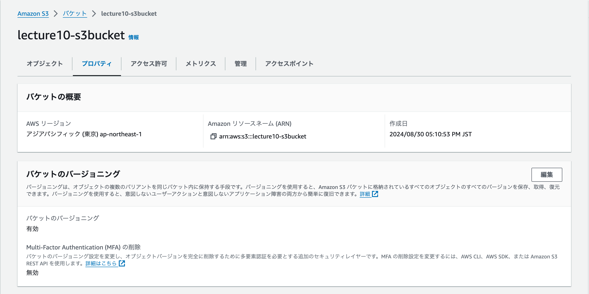

# AWSコース第10回講義の受講

## CloudFormationを利用して第5回課題で作成した環境のコード化を行う。
- VPC,EC2,RDS,ALB,S3のテンプレートファイルを作成
- テンプレートはVSCodeを使用してYAML形式で作成

## テンプレートファイル
- ［VPC］(lecture10template/lecture10-VPC.yml)
- ［EC2］(lecture10template/lecture10-EC2.yml)
- ［RDS］(lecture10template/lecture10-RDS.yml)
- ［ALB］(lecture10template/lecture10-ALB.yml)
- ［S3］(lecture10template/lecture10-S3.yml)

## VPC、ネットワークの構築
- VPC

## EC2の構築
- EC2

- EC2 SecurityGroup　

## RDSの構築
- RDS

- RDS SecurityGroup

## ALBの構築
- ALB

- TargetGroup

## S3の構築
- S3

