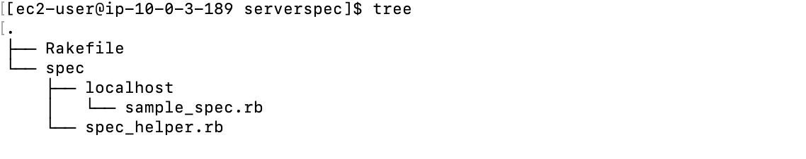
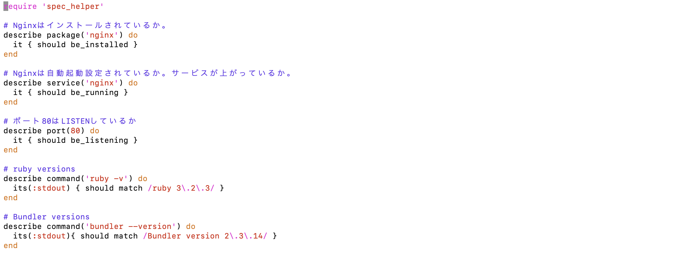
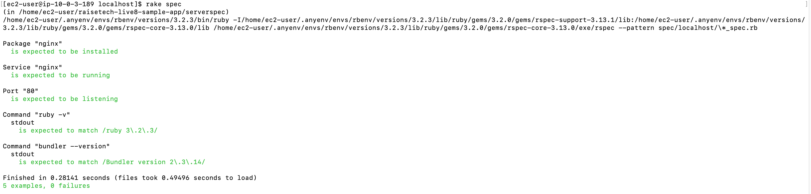

# AWSコース第11回講義の受講

## ServerSpecでインフラ環境のテスト実行
* SeverSpecのインストール 
  $ gem install serverspec 
  $ mkdir serverspec   
  $ cd serverspec  

* ServerSpec初期セットアップ 
  $ serverspec-init  

* sample_spec.rbの編集  

* テスト結果  
